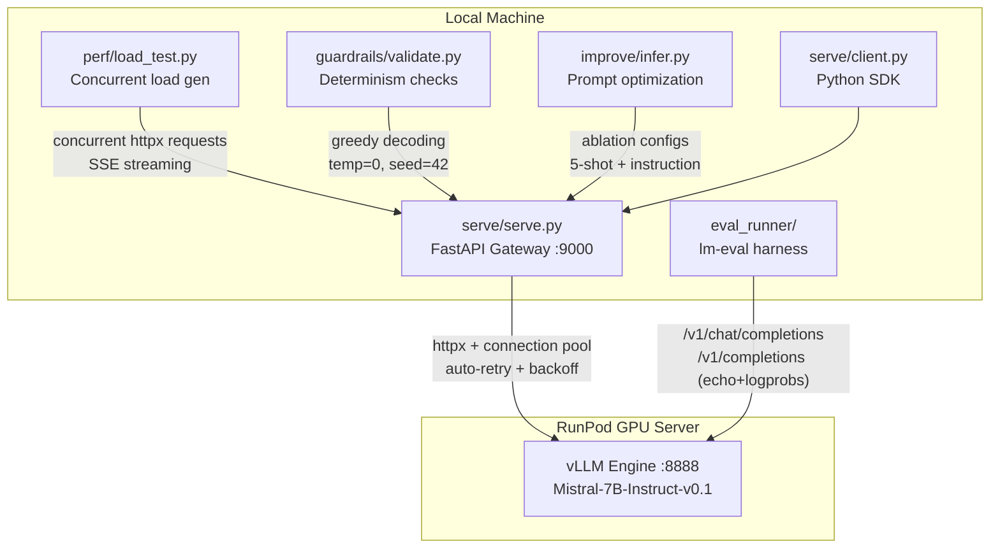
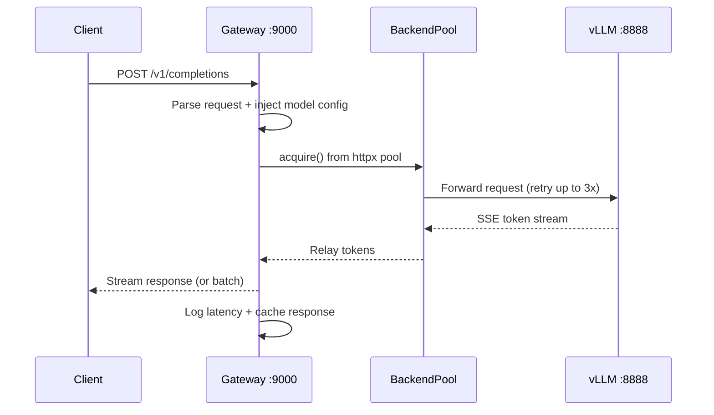
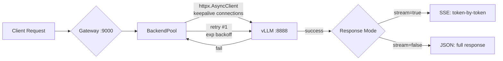
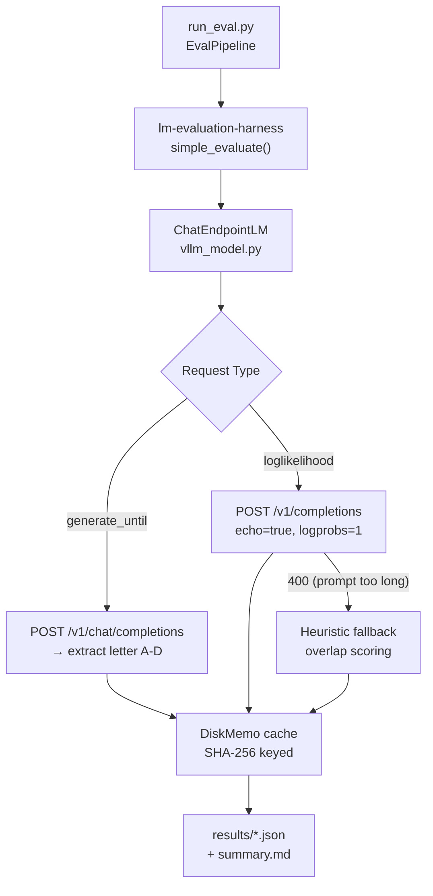
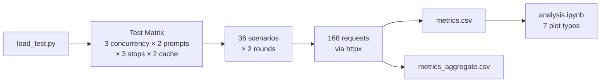
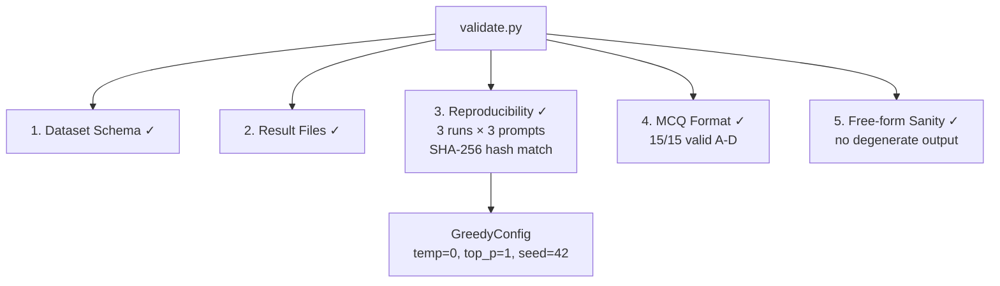
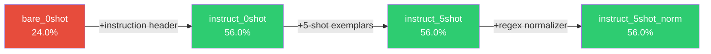

# LLM Evaluation Pipeline

End-to-end infrastructure for serving, evaluating, stress-testing, and optimizing **Mistral-7B-Instruct** via vLLM — zero finetuning, fully reproducible.

## System Architecture



## Request Lifecycle



## Quick Start

```bash
pip install -r requirements.txt
# Set your vLLM endpoint in .env
echo "VLLM_BASE=https://your-runpod-url:8888" > .env
echo "MODEL_NAME=mistralai/Mistral-7B-Instruct-v0.1" >> .env

python3 serve/serve.py  # start gateway on :9000
```

## Project Structure

```
├── serve/                    # Part A: Inference Gateway
│   ├── serve.py              # FastAPI async proxy (BackendPool, SSE streaming)
│   ├── config.py             # AppConfig frozen dataclass (reads .env)
│   ├── client.py             # InferenceSession SDK (connection pooling)
│   ├── sample_run.py         # 4 demo scenarios (batch, stream, fan-out, determinism)
│   └── benchmark_concurrent.py  # Queue-based concurrent stress test
│
├── eval_runner/              # Part B: Evaluation Harness
│   ├── vllm_model.py         # ChatEndpointLM (lm-eval interface)
│   ├── run_eval.py           # EvalPipeline CLI orchestrator
│   ├── cache.py              # DiskMemo (SHA-256 keyed prompt cache)
│   ├── custom_task/          # 15-question ML/AI benchmark
│   └── results/              # JSON outputs + summary.md
│
├── perf/                     # Part C: Performance & Scaling
│   ├── load_test.py          # httpx concurrent load generator
│   ├── metrics.csv           # 168 per-request measurements
│   ├── metrics_aggregate.csv # 36 scenario summaries
│   └── analysis.ipynb        # 7 plot types + commentary
│
├── guardrails/               # Part D: Guardrails & Determinism
│   ├── validate.py           # 5-check validation suite
│   ├── README.md             # Nondeterminism analysis
│   └── report.json           # Machine-readable last-run report
│
├── improve/                  # Part E: Benchmark Improvement
│   ├── prepare_data.py       # Downloads MMLU STEM from HuggingFace
│   ├── optimize_prompt.py    # Baseline vs optimized prompt builders
│   ├── infer.py              # 4-config ablation with bootstrap CI
│   ├── eval.sh               # End-to-end pipeline script
│   └── report.md             # Results + 10+ before/after examples
│
├── .env                      # Endpoint + model configuration
├── Makefile                  # make serve, make eval, make load-test, etc.
└── requirements.txt          # Pinned dependencies
```

---

## Part A — Serving Gateway



**What I built and why:**

- **`BackendPool`** — wraps `httpx.AsyncClient` with connection reuse. RunPod connections are expensive (~200ms TLS handshake); pooling eliminates that on repeat requests.
- **Auto-retry with backoff** — RunPod occasionally drops connections under load. The pool retries up to 3x with exponential delay instead of failing immediately.
- **SSE streaming** — tokens arrive one-by-one via Server-Sent Events. Useful for real-time UIs and for measuring TTFT in Part C.
- **`AppConfig` frozen dataclass** — reads `.env` once at startup, immutable after that. No global variables, no accidental mutation, clean DI.

---

## Part B — Evaluation Harness



**Key design decisions:**

- **Dual API scoring** — `generate_until` uses `/v1/chat/completions` for letter extraction. `loglikelihood` uses `/v1/completions` with `echo=true` + `logprobs=1` for real token-level log-probabilities. This matches how the harness scores multiple-choice tasks internally.
- **Graceful degradation** — if the text API returns 400 (prompt exceeds context window in 5-shot MMLU), we fall back to a heuristic overlap scorer instead of crashing. The harness always completes.
- **DiskMemo** — every prompt/response pair is cached with a SHA-256 hash key. Re-runs are deterministic and instant. Cache is stored in `results/eval_cache.json`.

**Benchmark Results:**

| Benchmark | Score | Scoring Method | Items |
|-----------|-------|----------------|-------|
| **MMLU** (STEM) | 46.0% accuracy | generate_until | 50 |
| **HellaSwag** | 35.0% / 45.0% norm | loglikelihood | 20 |
| **ml_reasoning** (custom) | 86.67% exact match | generate_until | 15 |

---

## Part C — Performance & Scaling



**Metrics captured per request:**

| Metric | How It's Measured |
|--------|------------------|
| **TTFT** | Timestamp of first SSE `data:` chunk minus request start |
| **TPOT** | Total tokens ÷ (last_token_time − first_token_time) |
| **P50/P95/P99** | NumPy percentiles over per-scenario latency arrays |
| **Throughput** | Requests completed ÷ wall-clock seconds |
| **GPU %** | nvidia-smi polling (shows N/A on remote endpoints) |

**Configuration sweep:** concurrency [1, 2, 4] × prompt [short, long] × stop [none, period, newline] × cache [hit, miss] = **36 unique scenarios**, each run twice for stability.

**Visualizations in `analysis.ipynb`:** latency vs concurrency, throughput heatmaps, TTFT distributions, cache hit impact, percentile breakdowns, stop-sequence effects, per-scenario comparison.

---

## Part D — Guardrails & Determinism



**Deterministic decoding config:** `temperature=0.0` (argmax), `top_p=1.0` (no nucleus truncation), `seed=42` (vLLM server-side RNG). Verified by hashing 3 identical runs — all SHA-256 digests match.

**Where nondeterminism can still appear:**
- FlashAttention reduction order varies with batch composition
- Tensor parallelism changes all-reduce ordering
- Prefix caching vs recompute can shift intermediate activations
- Currently: **synchronous greedy = fully deterministic** on our setup

---

## Part E — Benchmark Improvement



**+32 percentage point lift** on MMLU STEM (p = 0.0024, paired permutation test, 5000 permutations).

**What actually worked:** The entire lift came from one change — adding `"You are a world-class expert in {subject}. Reply with ONLY the letter."` Mistral-7B-Instruct is fine-tuned on instruction pairs; without explicit formatting instructions, it generates essay-style prose that our extractor can't parse. 6 of 9 "wrong" baseline answers actually contained the correct answer buried in text.

**What I deliberately avoided:** Chain-of-thought and self-consistency (k-sample voting) would multiply API calls by 3-5× with minimal marginal gain after the instruction fix. Our approach adds **zero extra API calls**.

Full ablation, 10+ before/after examples, bootstrap confidence intervals, and exact reproducibility settings in [`improve/report.md`](improve/report.md).

---

## Design Principles

| Principle | Implementation |
|-----------|---------------|
| **Fail gracefully** | Text API → heuristic fallback → default score. Pipeline never crashes mid-evaluation. |
| **Deterministic by default** | DiskMemo cache + GreedyConfig. Same inputs = same outputs, always. |
| **No global state** | Frozen dataclasses (`AppConfig`, `GreedyConfig`, `SamplingConfig`) injected via constructors. |
| **`httpx` everywhere** | Async-capable, connection pooling, proper timeouts. `requests` not used anywhere. |
| **Measure everything** | TTFT, TPOT, P50/P95/P99, cache hit rates, GPU util — all logged to CSV. |
| **Simplest fix first** | Part E proved this: one-line prompt change > complex ensemble methods. |

## Running the Full Suite

```bash
make serve            # Start gateway
make eval             # All 3 benchmarks
make load-test        # Full perf sweep (36 scenarios)
make guardrails       # 5-check validation
bash improve/eval.sh  # MMLU optimization pipeline
```
